% Intro to Shodan
% Joseph Cathell <kamikazejoe@gmail.com>
%<br/>Talk: [${TALK_URL}](${TALK_URL})<br/>Repo: [${REPO_URL}](${REPO_URL})

# What is it?

 - Search engine for the "Internet of Things"
 - Searches multiple types of servers, not just web servers
 - Indexes the returned banners from server connection
 - Will take screenshots when it can
 - HTTP/S, FTP, SSH, Telnet, SIP, RTSP, etc.

::: notes

Shodan is a search engine for internet-connected devices 
Instead of indexing web pages, it scans the internet and indexes:
service banners
open ports
version strings
and device metadata. 

It's usefule when you need to:
- map external attack surface, 
- find exposed infrastructure, 
- hunt for vulnerable services,
- or identify attacker C2 infrastructure.

In many ways it does what NMAP does, but they've already done the work for you.

:::
 
# Origins

 - Created by John Matherly
 - Hobby project while studying bio-inframatics
 - First pitched as "Netcraft for Everything"
 - Originally peer-to-peer shared nmap scans
 - Now scans the top 1000 ports once a week

::: notes

Shodan started as a hobby project by John Matherly while studying bioinformatics 
Pre-sumably when he wasn't playing 1994's System Shock
Originally pitched as "Netcraft for Everything" 
(Netcraft is/was a company that provided web server analytics and metrics)
Was built on peer-to-peer shared nmap scans. 
Today it's evolved into a full-scale search engine that scans the top 1,000 ports across the entire internet every week.

:::

# Basic Usage

- Browser usage
- Programatically

::: notes

Basically there's two ways to use Shodan
Go to shodan.io
Or through API

:::

## Basic Search

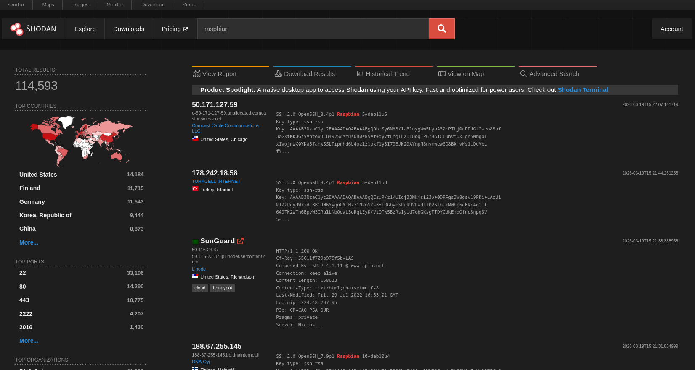

::: notes

On the face of it, the website works like any other search engine.
Put in your terms, and get results.

Here we search for Raspbian, the default Raspberry Pi OS
And we can see how many Raspberry Pi's are just raw dogging it on the internet.

:::

## Basic Search

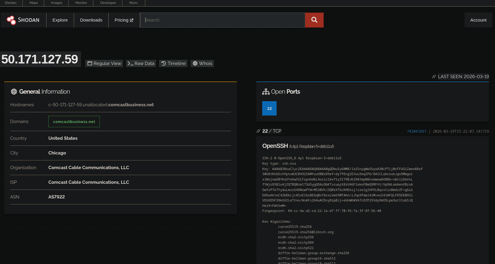

::: notes

Click on any result, and get more info.
- ISP information
- Open Ports
- Header information
- Etc

:::

## Basic Search

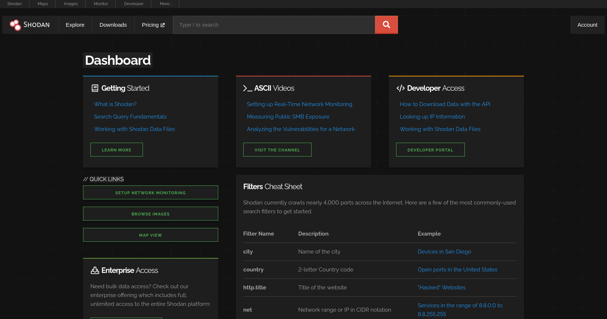

::: notes

But if you click on either the Shodan logo, or goto `shodan.io/dashboard`
You'll quickly learn there's a lot more you can do.
You can filter your results by location, network, or product name.


:::

## Getting Ideas

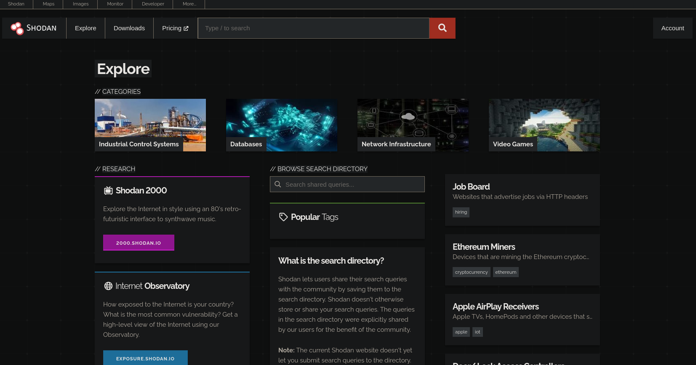

::: notes

If you start going through their documentation though and get overwelmed by the possibilities,
Then I suggest starting at the "Explore" page and get some ideas.
You'll find a severalinteresting categories to peruse, some research projects, and poplur queries
Just start looking around and see what frightening stuff is out there.

:::

## Monitoring Networks

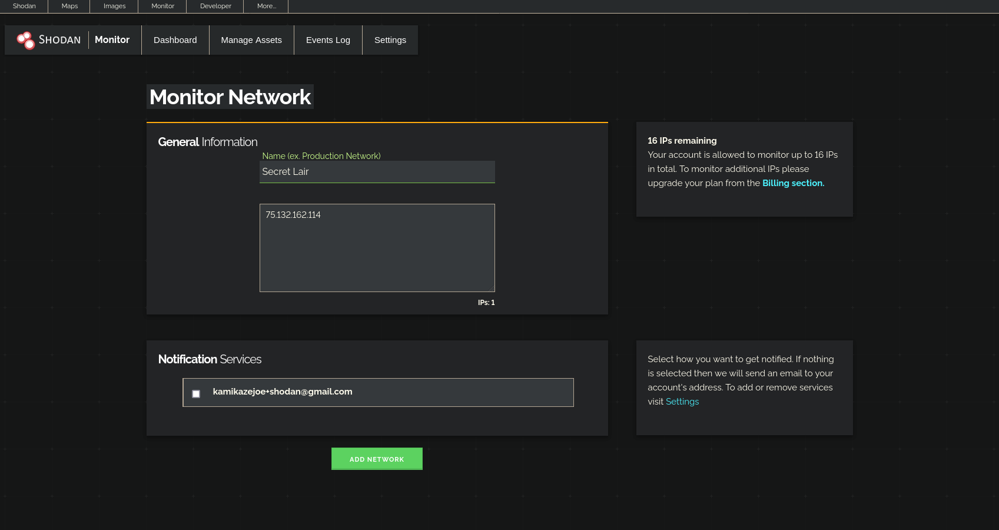

::: notes

Okay, this is all great, but we are good little hackers.
We aren't here to stir up shit and cause chaos. *crickets*

How can we use this productively?
Well if you set yourself up an account, you can specifically use it to monitor your exposed network.


:::

## Monitoring Networks

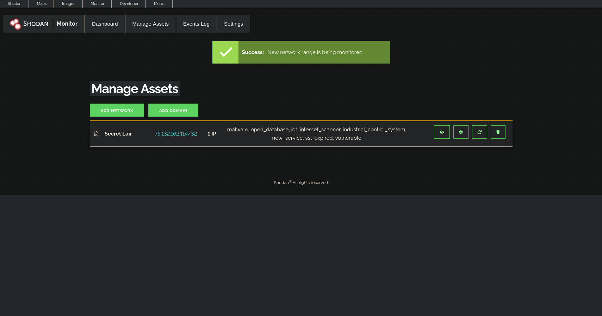

::: notes

Simply enter in your external IP, and Shodan will start notifying you of when it detects any chagnes.
Such as:
- New open ports
- SSL isues
- Detected vulnerabilities

:::

## Monitoring Networks

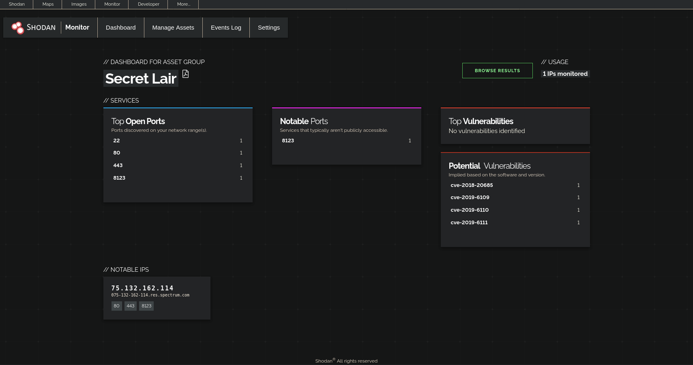

::: notes

You also get a nice little dashboard report showing you what it's found so far.

:::

## Shodan Images

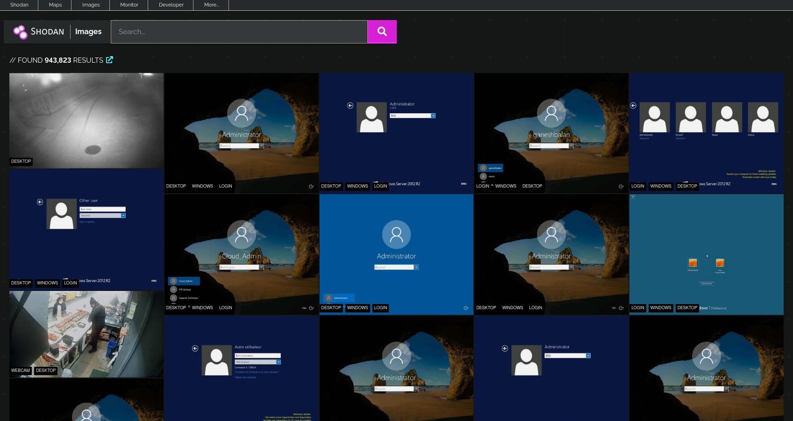

::: notes

Images.shodan.io is a voyeristic time sink.
Basically, when Shodan finds a service that can be screenshotted, it get's posted here.
Here you'll mostly find Login pages and webcams.

:::

## Shodan Images

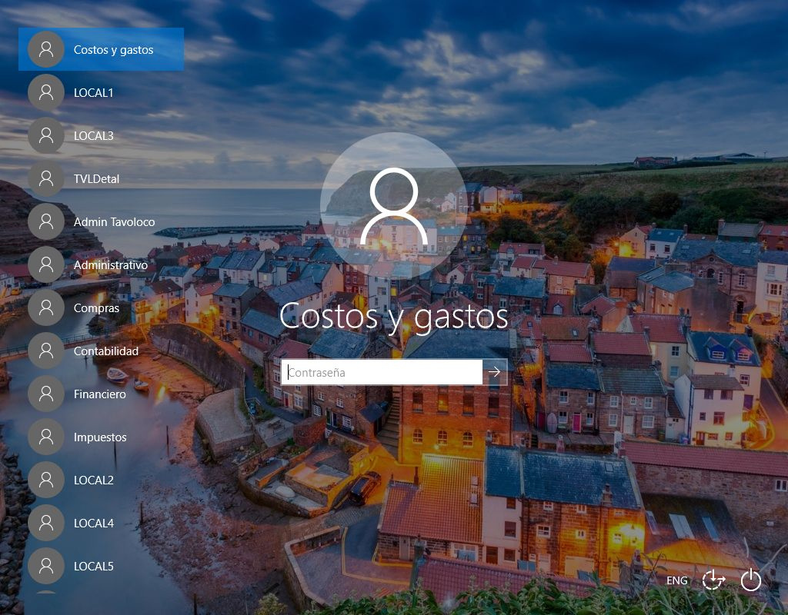

::: notes

Now this may not immediately seem useful, but look at this particular page.
Look at how many accounts there are.
There's 13 visible account names that you've enumerated if this were an engagement.

:::

## Shodan Images

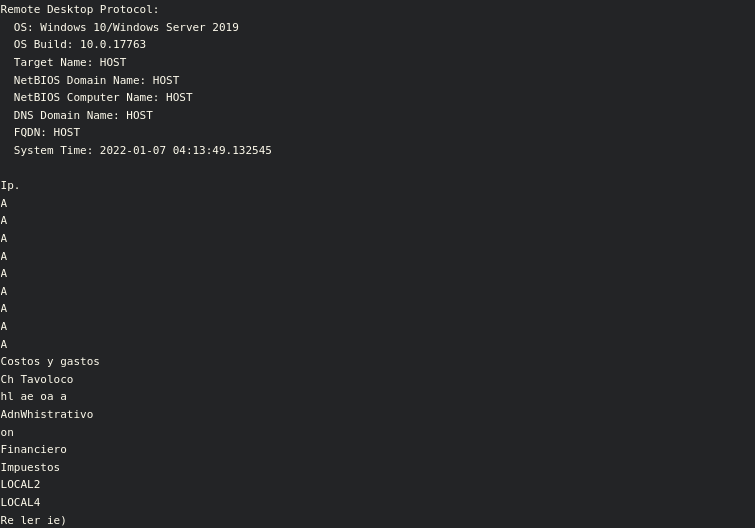

::: notes

Now here's the best part.
Shodan will OCR any text on the screenshot.
So you don't even have to type out the names yourself.
Just copy and paste.

:::

## Shodan Images

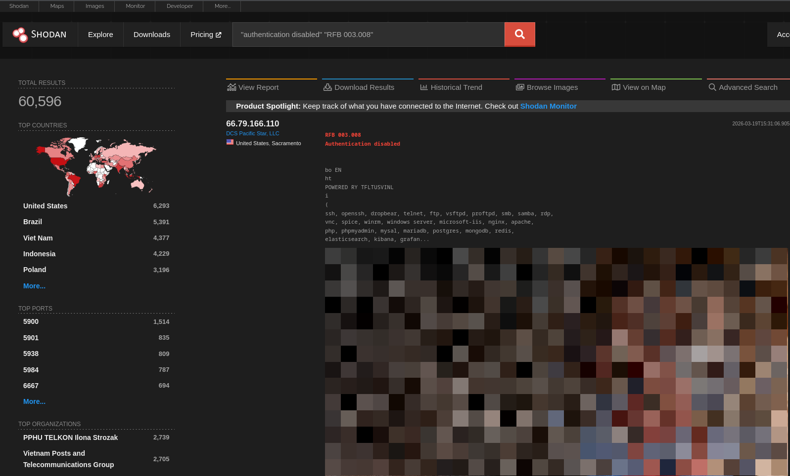

::: notes

A word of note, be careful browsing these images.
More nefarious types make use of shodan as well.
They go around finding vulnerable remote systems and change the wallpaper to something offensive.
I can't unsee some things.

:::

## Shodan Maps

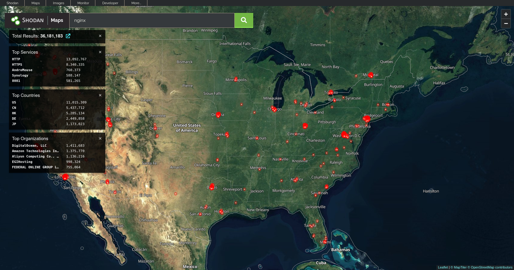

::: notes

Shodan Maps is a fun toy.
Let's you geographically map out your search results.
When I move I like to use this to see how technically competent my new neighbors are.

:::

## Shodan Trends

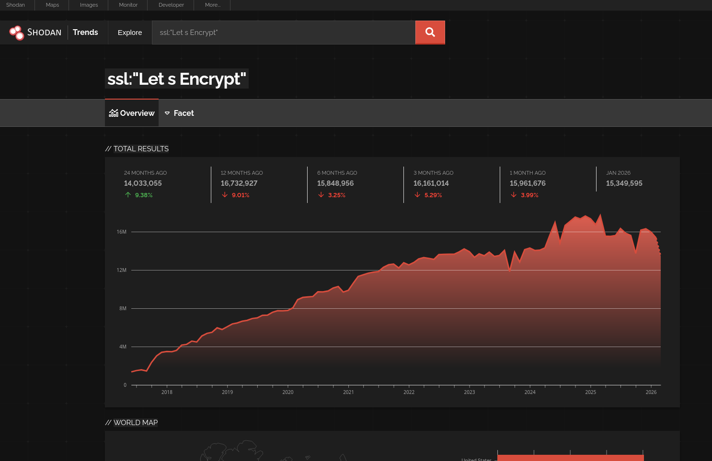

::: notes

Shodan Trends is a useful tool if you are doing research.
It lets you track queries over time.
For example, you can plot the increase of Let's Encrypt certificate usage over time.

:::

## Shodan Exploits

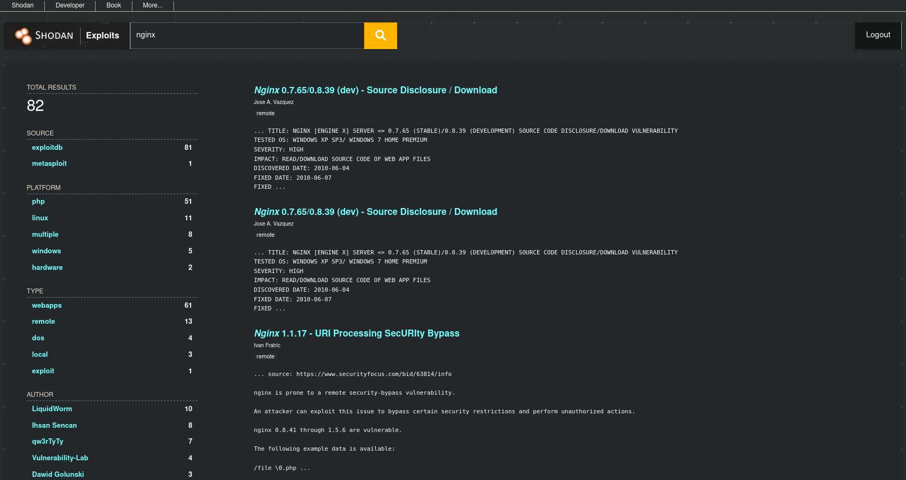

::: notes

notes go here

:::

## Internet Exposure Observatory

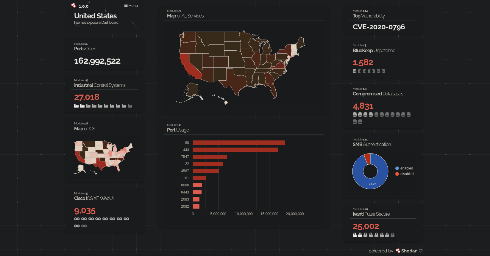

::: notes

notes go here

:::


## SHODAN 2000!!!

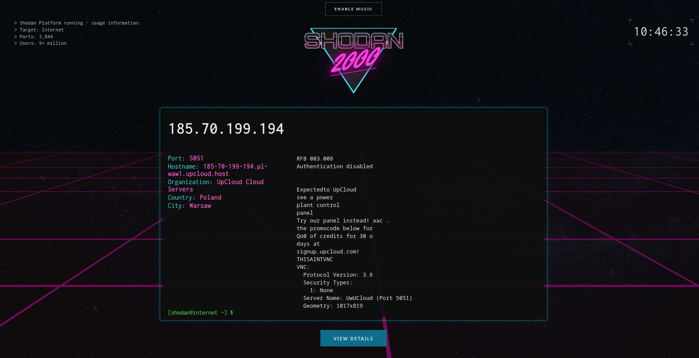

::: notes

notes go here

:::

# Retired Services

::: notes

A lot of times Shodan just likes to experiment.
If the tool isn't super useful, it may be retired.
Here's a couple that I miss having.

:::

## Honeypot or Not

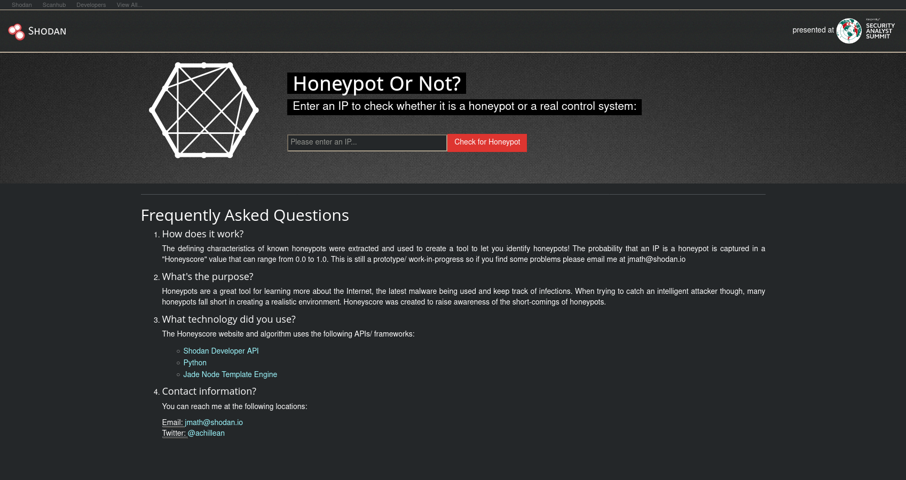

::: notes

Honeypot or Not let you check whether an IP address was hosting a honeypot.
Nice for when something seems too good (or bad) to be true.
Rest in peace...

:::

## ICS Radar

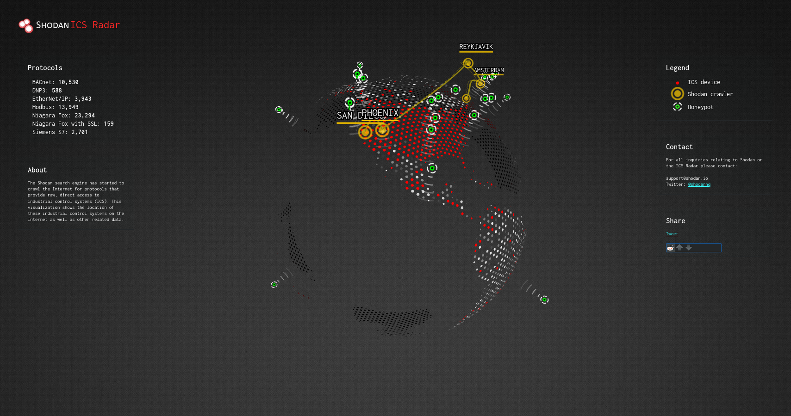

::: notes

ICS Radar, while cool was less useful.
It was basically just one of those cyber-attack maps showing ICS searches

:::

# Accessing Shodan Programatically

 - REST API
 - Well documented rest API available for all functionality
 - Third-party client libraries are available for all major languages

::: notes

Of course, if you want to really integrate it into your workflow,
you'll probably want to use the API or command line.

:::

# Command line client

::: notes

The easiest way to get started is with the command line client.
So let's dabble with it a bit.

:::

## CLI - Basics

- `shodan search <Search Term>`
- `shodan count <Search Term>`
- `shodan domain/host <domain/IP>`
- `shodan download <filename> <Search Term>`
- `shodan parse <filename>`

::: notes

For the sake of time we'll speed through the basics:

- Perform a search and print the results in a TSV format
- Perform a search and print the number of matching results
- Perform a search and download the full JSON results to a compressed file 
- Parse a previously downloaded set of search results to extract specific data

:::

## CLI - General Advice
 - Save search results locally, then process later to save credits
 - Use external tools like `jq` to parse results
 - Import results into spreadsheets for analysis
 - Use limts to preserve your credits

::: notes

notes go here

:::

# CLI - Fake Demo
 - Goal is to get a port scan of router admin pages in St. Louis

::: notes

Here are screenshots of a demo.

The goal, as stated, is to find router admin pages in the St. Louis area

In addition to the shodan CLI, we'll be using the commands:
- jq
- parallel
- map

:::

## CLI - Demo - Count Results


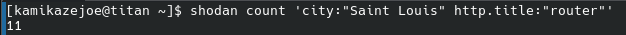

::: notes

Input
```
shodan count 'city:"Saint Louis" http.title:"router"'
```

Output
```
11
```

:::

## CLI - Demo - Download Results

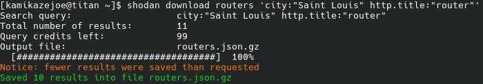


::: notes

Input
```
shodan download routers 'city:"Saint Louis" http.title:"routers"’
```

Results will be written to `routers.json.gz`

:::
 
## CLI - Demo - Get Servers

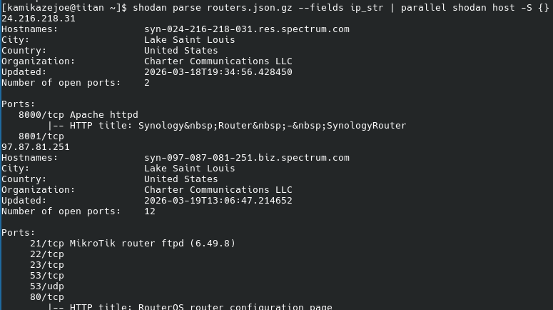

::: notes

Input
```
shodan parse ha-servers.json.gz --fields ip_str | parallel shodan host -S {}
```

:::

 
## CLI - Demo - Get Servers


::: notes

Results will be written to `<ip>.json.gz` for each host

:::

## CLI - Demo - Get Portscan

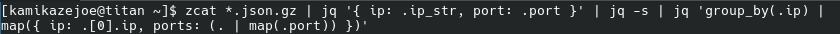

::: notes

Next we get a little crazy.

Input
```
zcat *.json.gz | \
    jq '{ ip: .ip_str, port: .port }' | \
    jq -s | \
    jq 'group_by(.ip) | \
    map({ ip: .[0].ip, ports: (. | map(.port)) })'
```

:::

## CLI - Demo - Get Portscan

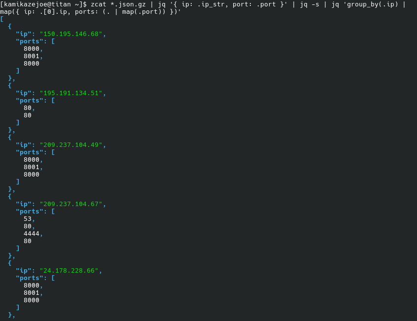

::: notes

Not shown here, but at the bottom there was an address that had lots of open ports

  {
    "ip": "97.87.81.251",
    "ports": [
      21,
      22,
      23,
      53,
      53,
      80,
      85,
      443,
      1701,
      1723,
      2000,
      8291,
      8728,
      80
    ]
  }


:::

# Top 5 Cleverest/Scariest/Weirdest Queries

## No authentication VNC
`"authentication disabled" "RFB 003.008"`

## Unsecured Elasticsearch Clusters
`product:Elastic "security features are not enabled"`

## FLIR Cameras
`FLIR product:"FLIR Systems  Inc. CP-6302-31-I"`

## Voting systems in the US
`"voter system serial" country:US`

## Rickroll EVERYONE!
```
shodan search "Chromecast:" port:8008 | \
   grep -E -o "([0-9]{1,3}[\.]){3}[0-9]{1,3}" | \
   xargs -I {} \
   vlc rickroll.mp4 --sout "#chromcast" --sout-chromecast-ip={} --dmux-filter=demux_chromecast &

```
